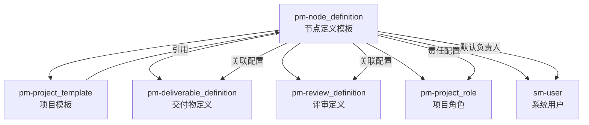

# PM 项目节点定义模板模块专家

## 模块定位

`pm-node_definition`（项目节点定义模板）是 **PSC（项目配置中心）** 的核心子模块，负责定义项目执行过程中单个节点的标准化模板。节点定义模板是项目模板的组成单元，决定了项目节点的行为、交付要求、评审流程和通知规则。

### 模块职责边界

| 职责 | 归属模块 | 说明 |
|------|----------|------|
| 节点模板的 CRUD | pm-node_definition | 单个节点定义模板的创建、编辑、删除 |
| 节点基础信息配置 | pm-node_definition | 编码、名称、分类、负责人、工时等 |
| 节点交付物配置 | pm-node_definition | 配置节点需要提交的交付物模板 |
| 节点评审配置 | pm-node_definition | 配置节点的评审项模板 |
| 节点通知配置 | pm-node_definition | 配置交付物确认通知规则 |
| 节点功能开关配置 | pm-node_definition | 配置节点启用的功能特性 |
| 项目模板编排 | pm-project_template | 将节点定义组合成完整项目模板 |
| 交付物定义管理 | pm-deliverable_definition | 管理交付物模板本身的定义 |
| 评审定义管理 | pm-review_definition | 管理评审项模板本身的定义 |

## 核心数据模型

### NodeDefinition（节点定义）

```typescript
interface NodeDefinition {
  // 基础信息
  id: number;                    // 节点定义ID
  code: string;                  // 节点编码（自动生成）
  name: string;                  // 节点名称
  isActive: boolean;             // 是否启用

  // 分类与属性
  category: string;              // 节点类型（枚举值）

  // 责任配置
  defaultOwnerId?: number;       // 默认负责人ID
  projectRoleId?: number;        // 关联项目角色ID

  // 工作量配置
  defaultWorkhours?: number;     // 默认工时

  // 评价配置
  evaluateOnComplete?: boolean;  // 完成时是否弹窗评价

  // 功能配置
  featureConfigs?: string[];     // 启用的功能特性代码数组

  // 关联配置
  deliverableDefinitions?: DeliverableConfig[];  // 交付物配置
  reviewItems?: ReviewItemConfig[];              // 评审配置
  notifyConfigs?: NotifyConfig[];                // 通知配置

  // 元数据
  remark?: string;               // 备注
  currentCreatedAt?: string;     // 创建时间
  currentCreatedByNickname?: string;  // 创建者
}
```

### DeliverableConfig（交付物配置）

```typescript
interface DeliverableConfig {
  id?: number;                   // 关系表ID（编辑时使用）
  versionId: number;             // 交付物定义版本ID（必填）
  sortOrder: number;             // 排序序号
  functionRestriction?: string;  // 功能限制（枚举值）
}
```

### ReviewItemConfig（评审配置）

```typescript
interface ReviewItemConfig {
  versionId: number;             // 评审定义版本ID（必填）
  sortOrder: number;             // 排序序号
}
```

### NotifyConfig（通知配置）

```typescript
interface NotifyConfig {
  triggerDeliverable: string;    // 触发节点交付物
  target: string;                // 通知对象
  visible: "show" | "hide";      // 逻辑（显示/不显示）
}
```

## 权限验证流程

### 操作权限映射

| 操作 | 权限代码 | 说明 |
|------|----------|------|
| 查看列表 | PSC.view_definitions | 浏览节点定义列表 |
| 新增 | PSC.add_definitions | 创建新节点定义 |
| 编辑 | PSC.change_definitions | 修改节点定义 |
| 删除 | PSC.delete_definitions | 删除节点定义 |
| 启用/禁用 | PSC.change_definitions | 修改节点定义状态 |

### 前端权限校验示例

```javascript
import { validatePerm } from '@/utils/index'

// 编辑按钮权限校验
const handleUpdate = (row) => {
  const isEdit = validatePerm('PSC.change_definitions', false);
  router.push({
    path: `nodedefinition/edit/${row.id}/${isEdit ? 'edit' : 'view'}`
  });
};
```

## 认证与授权区别说明

- **认证（Authentication）**：通过 Token 验证用户身份，在 `utils/request.js` 拦截器中统一处理
- **授权（Authorization）**：基于 RBAC 模型，通过 `validatePerm()` 函数验证用户是否具备特定操作权限

## 与其他模块关系



### 关键依赖关系

1. **项目模板依赖**：项目模板由多个节点定义按顺序编排组成
2. **交付物定义**：节点定义通过 `versionId` 关联交付物定义的特定版本
3. **评审定义**：节点定义通过 `versionId` 关联评审定义的特定版本
4. **项目角色**：节点定义可绑定项目角色作为节点责任人
5. **系统用户**：节点定义可设置默认负责人

## 常见业务场景

### 1. 创建标准节点定义

**场景**：为研发项目创建"设计评审"节点模板

**操作流程**：
1. 新增节点定义，填写基础信息（编码、名称、分类）
2. 选择节点类型（如：设计评审、开发、测试等）
3. 配置默认负责人或项目角色
4. 设置默认工时
5. 配置交付物：选择"设计文档"模板，设置功能限制
6. 配置评审项：选择"设计评审检查表"模板
7. 配置功能开关：启用"多人协同"、"子任务管理"等
8. 保存后生成节点编码

### 2. 复制节点定义

**场景**：基于现有节点定义快速创建新节点

**操作流程**：
1. 在列表页选中一条记录
2. 点击"复制"按钮
3. 系统跳转到新增页面，并预填充源数据
4. 修改名称等差异化信息
5. 保存生成新节点定义

### 3. 版本管理关联

**场景**：关联交付物/评审定义的特定版本

**实现机制**：
- 交付物配置使用 `versionId`（交付物定义当前版本ID）
- 评审配置使用 `versionId`（评审定义当前版本ID）
- 前端通过 `getDefinitionsSimpleList` 和 `getReviewDefinitionsSimpleList` 获取带版本信息的简单列表
- 下拉框的 value 绑定 `currentVersionId`，确保后端接收正确的版本ID

## 技术实现建议

### 前端技术栈

- **框架**：Vue 3 Composition API + `<script setup>`
- **路由**：Hash 模式，`/psc/nodedefinition/*`
- **组件复用**：`nodeRuleRender.vue` 作为新增/编辑/查看的共用渲染组件
- **表格组件**：`nodeRuleConfigTable.vue` 可编辑表格组件，用于交付物/评审/通知配置
- **状态管理**：Pinia stores
- **权限校验**：`validatePerm()` 函数

### 关键代码位置

| 功能 | 文件路径 |
|------|----------|
| API 接口 | `src/api/psc/nodedefinition.js` |
| 列表页 | `src/views/psc/nodedefinition/index.vue` |
| 新增页 | `src/views/psc/nodedefinition/add.vue` |
| 编辑页 | `src/views/psc/nodedefinition/edit.vue` |
| 渲染组件 | `src/views/psc/nodedefinition/components/nodeRuleRender.vue` |
| 配置表格 | `src/views/psc/nodedefinition/components/nodeRuleConfigTable.vue` |
| 路由配置 | `src/router/modules/psc.js` |

### 数据映射示例

**后端 → 前端映射**（编辑页加载时）：
```javascript
// 交付物配置映射
deliverableConfigs = versionData.deliverableDefinitions.map(item => ({
  id: item.id,                              // 关系表ID
  name: item.deliverableDefinitionId,       // 下拉框绑定值
  currentDisplayVersion: item.deliverableDefinitionVersion,
  functionRestriction: item.functionRestriction
}));

// 评审配置映射
reviewConfigs = versionData.reviewItems.map(item => ({
  id: item.reviewDefinitionVersionId,
  subject: item.reviewDefinitionVersionId,  // 下拉框绑定值
  deliverable: item.reviewDefinitionDeliverableName,
  createdAt: item.createdAt
}));
```

**前端 → 后端映射**（保存时）：
```javascript
// 交付物配置
data.deliverableDefinitions = deliverableListRaw.map((row, index) => ({
  versionId: row.versionId ?? row.name,
  sortOrder: index + 1,
  functionRestriction: row.functionRestriction
}));

// 评审配置
data.reviewItems = reviewListRaw.map((row, index) => ({
  versionId: row.subject,
  sortOrder: index + 1
}));
```

## 扩展设计策略

### 1. 功能配置扩展

当前通过 `featureConfigs` 数组管理功能开关，新增功能时：

1. 后端在枚举接口 `psc/node/definitions/enums` 中添加新功能代码
2. 前端自动渲染为 Checkbox 选项（按 `featureConfigCategories` 分组显示）
3. 每个功能项可配置 `tips` 提示信息，通过图标悬停展示
4. 保存时将选中的功能代码数组提交给后端

**功能配置分类**：
- **配置清单设置**：配置清单编辑、交付物上传、交付物复核、交付物仅下载
- **变更设置**：变更说明、变更确认
- **功能属性设置**：时间线预设、提交测试、需求评审

### 2. 交付物限制扩展

当前 `functionRestriction` 字段支持扩展，可添加：

- 必填/可选标记
- 文件大小限制
- 文件格式校验
- 审批流程限制

### 3. 通知配置增强

当前通知配置较简单，可扩展为：

```typescript
interface NotifyConfig {
  triggerDeliverable: string;
  target: string;                // 通知对象（用户/角色/部门）
  targetType: 'user' | 'role' | 'dept';
  visible: "show" | "hide";
  notificationMethod: 'email' | 'sms' | 'system';
  template?: string;             // 通知模板
}
```

## 演进方向（Future Evolution）

### Phase 1：版本化增强

- **节点定义版本管理**：支持节点定义的多版本管理
- **版本继承**：新版本可基于旧版本创建
- **版本回滚**：支持回退到历史版本

### Phase 2：智能推荐

- **交付物智能推荐**：根据节点类型推荐常用交付物模板
- **评审项智能推荐**：根据行业最佳实践推荐评审检查表
- **配置模板库**：提供预定义的节点配置模板

### Phase 3：动态配置

- **条件配置**：根据项目属性动态应用不同配置
- **配置继承**：支持从父节点继承配置
- **配置覆盖**：允许在项目实例中覆盖节点模板配置

### Phase 4：集成增强

- **工作流集成**：与审批工作流深度集成
- **甘特图集成**：支持节点在甘特图中的可视化配置
- **风险管理**：集成风险识别和预警机制

## API 规范文档

详见 `api-spec.md`

## 特有名词索引

| 名词 | 说明 | 快速定位 |
|------|------|----------|
| 节点定义 | NodeDefinition，项目节点的标准化模板 | 本模块核心实体 |
| 节点模板 | 与节点定义同义，强调其模板属性 | 核心概念 |
| 交付物配置 | 节点需要提交的交付物定义配置 | 关联配置 |
| 评审配置 | 节点的评审项定义配置 | 关联配置 |
| 版本ID | 交付物/评审定义的版本标识，用于关联特定版本 | 关键字段 |
| 功能配置 | 节点启用的功能特性开关 | 扩展配置 |
| 通知配置 | 交付物确认的通知规则配置 | 扩展配置 |
| 节点类型 | 节点的分类枚举值 | 枚举字段 |

## 参考文档

- `models.md` - 详细数据模型定义
- `permission-flow.md` - 权限流程详解
- `api-spec.md` - API 规范与响应示例
- `evolution.md` - 演进路线图
