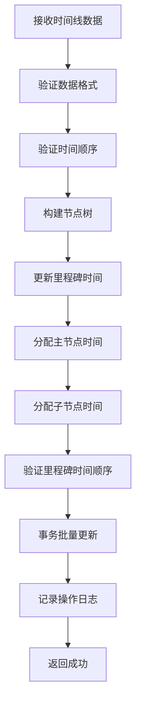
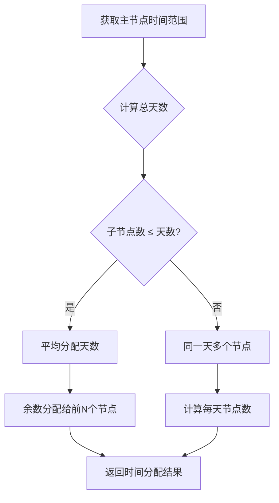

# PM - Timeline 模块说明

> 最后更新：2026-03-31
> App: `PM` | 目录: `apps/PM/timeline/`

---

## 模块概述

时间线模块是项目管理系统（PMS）中的核心模块，负责管理项目节点的时间规划和时间分配。该模块提供项目时间线的可视化数据，支持批量更新节点时间，并通过智能算法自动分配子节点时间。

---

## 目录结构

```
apps/PM/timeline/
├── __init__.py
├── views.py              # 视图（获取/更新时间线）
├── serializers.py        # 序列化器
└── utils.py              # 工具函数（时间分配算法）
```

---

## 核心功能

### 1. 时间线展示

获取项目里程碑节点的时间线信息，用于前端甘特图等可视化展示。

**特点**:
- 仅显示里程碑节点（category = MILESTONE）
- 返回项目创建时间和交付时间作为参考
- 时间格式统一为 YYYY-MM-DD

---

### 2. 时间线更新

批量更新项目节点时间，系统自动分配子节点时间。

**更新层级**:
1. **里程碑节点**: 直接设置开始和结束时间
2. **主节点**: 时间跟随所属里程碑
3. **子节点**: 时间在主节点范围内平均分配

---

### 3. 时间分配算法

实现智能的时间分配算法，确保子节点时间合理分配。

**算法规则**:
- 当子节点数 ≤ 总天数：平均分配天数
- 当子节点数 > 总天数：同一天可能有多个节点

---

## 数据模型

### Project_Node（项目节点）

时间线模块基于 `Project_Node` 模型，该模型定义在 `apps/PM/nodelist/models.py`。

**表名**: `PM_project_node`

**时间相关字段**:

| 字段 | 类型 | 说明 |
|------|------|------|
| start_time | DateTime | 节点开始时间 |
| end_time | DateTime | 节点结束时间 |
| complete_time | DateTime | 节点完成时间 |

**层级关系字段**:

| 字段 | 类型 | 说明 |
|------|------|------|
| node_category | String | 节点分类（MILESTONE/MAIN_NODE/SUB_NODE） |
| parent | ForeignKey | 父节点（自关联） |
| node_parent_id | Integer | 父节点ID |

**关联字段**:

| 字段 | 类型 | 说明 |
|------|------|------|
| node_definition | ForeignKey | 节点定义（PSC.NodeDefinitionVersion） |
| list | ForeignKey | 所属项目（PM.Project_List） |

---

## 枚举定义

### NodeState（节点状态）

| 值 | 说明 | 颜色 |
|----|------|------|
| 0 | 待处理 | 灰色 (#d2d3d7) |
| 1 | 进行中 | 黄色 (#efc95f) |
| 2 | 已完成 | 绿色 (#68b948) |
| 4 | 项目变更中 | 紫色 (#793AFF) |
| 5 | 申请中 | 紫色 (#793AFF) |

### NodeCategory（节点分类）

| 值 | 说明 |
|----|------|
| MILESTONE | 里程碑节点（根节点） |
| MAIN_NODE | 主节点（第二层） |
| SUB_NODE | 子节点（第三层） |

---

## 树形结构

项目节点采用三层树形结构：

```
项目 (Project_List)
├── 里程碑节点1 (MILESTONE)
│   ├── 主节点1 (MAIN_NODE)
│   │   ├── 子节点1 (SUB_NODE)
│   │   ├── 子节点2 (SUB_NODE)
│   │   └── ...
│   └── 主节点2 (MAIN_NODE)
│       ├── 子节点3 (SUB_NODE)
│       └── ...
├── 里程碑节点2 (MILESTONE)
│   └── ...
└── ...
```

**层级关系**:
- 里程碑节点为根节点（`parent` 为空）
- 主节点的 `parent` 指向里程碑节点
- 子节点的 `parent` 指向主节点

---

## 对外接口

### 视图

#### ViewsNodeTimeline

**路径**: `timeline/views.py`

**方法**:
- `get()`: 获取项目时间线
- `put()`: 更新项目时间线

**权限**: `IsAuthenticated`

---

### 序列化器

#### NodeTimelineDisplaySerializer

时间线展示序列化器，用于返回里程碑节点列表。

**输出字段**:
```python
{
    'id': int,
    'name': str,
    'state': int,
    'startTime': str,  # YYYY-MM-DD格式
    'endTime': str     # YYYY-MM-DD格式
}
```

**特点**:
- 自动将时间转换为本地时区
- 统一输出为 YYYY-MM-DD 格式

---

#### NodeTimelineSerializer

单个节点时间更新序列化器，处理时间验证。

**输入字段**:
```python
{
    'nodeId': int,           # 节点ID
    'startDate': DateTime,   # 开始时间
    'endDate': DateTime      # 结束时间
}
```

**验证逻辑**:
- 时间顺序验证：开始时间不能晚于结束时间
- 时区转换：自动转换为 UTC 时间存储
- 历史验证（v1.3.6已关闭）：
  - 开始时间不能早于项目创建时间
  - 结束时间不能晚于项目交付时间

---

#### NodeTimelineUpdateSerializer

时间线批量更新序列化器，处理完整的时间线更新逻辑。

**输入字段**:
```python
{
    'projectId': int,        # 项目ID
    'timeline': [            # 时间线数据数组
        {
            'nodeId': int,
            'startDate': DateTime,
            'endDate': DateTime
        }
    ]
}
```

**执行方法**: `execute_update()`

**执行流程**:
1. 构建项目节点树
2. 更新里程碑节点时间
3. 分配主节点时间（跟随里程碑）
4. 分配子节点时间（平均分配）
5. 验证时间顺序
6. 使用事务批量更新
7. 记录操作日志

---

## 工具函数

### get_project_node_tree_with_time

**路径**: `timeline/utils.py`

**功能**: 获取项目节点的树形结构和时间信息

**参数**:
- `project_id`: 项目ID

**返回**: 树形结构的节点列表

**返回结构**:
```python
[
    {
        'id': int,
        'name': str,
        'category': str,
        'start_time': DateTime,
        'end_time': DateTime,
        'parent_id': int,
        'sub_nodes': [  # 子节点列表
            {
                'id': int,
                'name': str,
                'category': str,
                'start_time': DateTime,
                'end_time': DateTime,
                'parent_id': int,
                'sub_nodes': [...]
            }
        ]
    }
]
```

**算法**: 使用字典映射构建树形结构，时间复杂度 O(n)

---

### split_time_for_sub_nodes

**路径**: `timeline/utils.py`

**功能**: 将时间段平均分配给子节点

**参数**:
- `start_time`: 开始日期
- `end_time`: 结束日期
- `node_count`: 子节点数量

**返回**: 包含每个节点开始和结束时间的字典列表

**分配规则**:

**场景1**: 节点数 ≤ 总天数
- 平均分配天数
- 余数天数依次分配给前面的节点

**示例**: 10天时间，3个子节点
```
节点1: 4天
节点2: 3天
节点3: 3天
```

**场景2**: 节点数 > 总天数
- 同一天分配多个节点
- 每个节点占一天

**示例**: 5天时间，10个子节点
```
第1天: 节点1-2
第2天: 节点3-4
第3天: 节点5-6
第4天: 节点7-8
第5天: 节点9-10
```

---

## API路由

**URL配置**: `apps/PM/urls.py`

```python
re_path(r'^timeline(/(?P<code>[a-zA-Z0-9_,]+)?)?/?$', ViewsNodeTimeline.as_view())
```

**路由说明**:
- `code` 参数通过 URL 路径传递项目ID
- 支持 `/timeline/{project_id}` 格式

---

## 依赖关系

### 外部依赖

| 模块 | 依赖说明 |
|------|----------|
| `PM.Project_List` | 项目主表 |
| `PM.Project_Node` | 项目节点（核心模型） |
| `PSC.NodeDefinitionVersion` | 节点定义版本 |

### 内部依赖

- `PM.nodelist.models.Project_Node`
- `PM.nodelist.enums.Choices`

---

## 业务流程

### 时间线更新流程



### 时间分配流程



---

## 权限控制

所有接口需要用户认证：

| 操作 | 权限要求 |
|------|----------|
| 获取时间线 | 需要登录（IsAuthenticated） |
| 更新时间线 | 需要登录（IsAuthenticated） |

---

## 禁止事项

1. **禁止时间倒置**: 开始时间不能晚于结束时间
2. **禁止里程碑时间交叉**: 后续里程碑的开始时间不能早于前一个里程碑
3. **禁止无数据更新**: 必须提供时间线数据才能更新
4. **禁止非项目节点操作**: 只能操作属于该项目的节点

---

## 时区处理

**存储时区**: UTC（协调世界时）

**显示时区**: Asia/Shanghai（中国标准时间）

**转换规则**:
- 接收请求时：将输入时间转换为 UTC 存储
- 返回响应时：将 UTC 时间转换为本地时区显示

---

## 事务安全

所有时间线更新操作在数据库事务中执行：

```python
with transaction.atomic():
    for node_id, time_data in result_nodes_data.items():
        model_node.objects.filter(id=node_id).update(
            start_time=time_data['start_time'],
            end_time=time_data['end_time']
        )
```

**好处**:
- 确保所有更新要么全部成功，要么全部回滚
- 防止部分更新导致的数据不一致

---

## 操作日志

每次时间线更新会自动记录操作日志：

```python
common.projectInsertPeratorLog(
    project_id=project_instance.id,
    content="更新项目时间线",
    user_id=request.user.id,
)
```

**记录内容**:
- 项目ID
- 操作内容
- 操作用户ID

---

## 版本变更

### v1.3.6

**变更内容**:
- 关闭历史时间验证
- 允许设置任意时间范围（不受项目创建时间和交付时间限制）

**影响**:
- 用户可以设置早于项目创建时间的时间线
- 用户可以设置晚于项目交付时间的时间线

---

## 相关文档

- **API接口文档**: `.claude/docs/api/pm-timeline.md`
- **数据关系**: `.claude/docs/data-relationship.md`
- **数据流**: `.claude/docs/data-flow.md`
