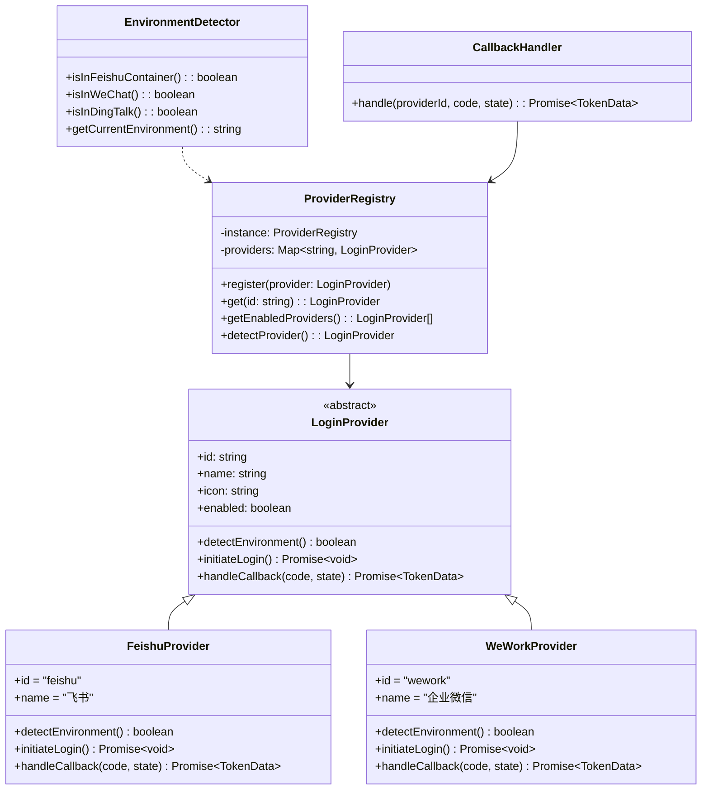
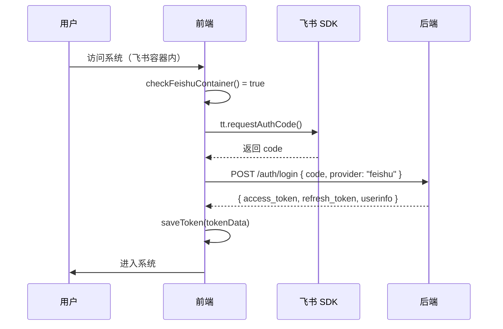
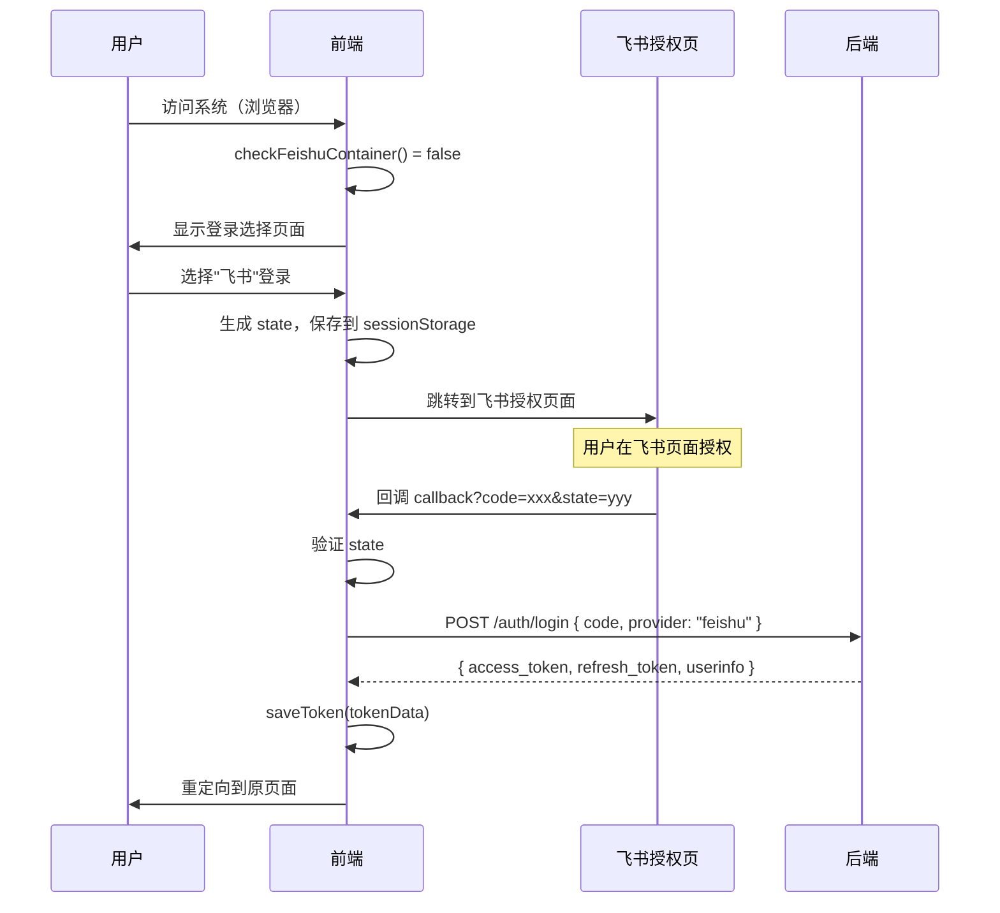
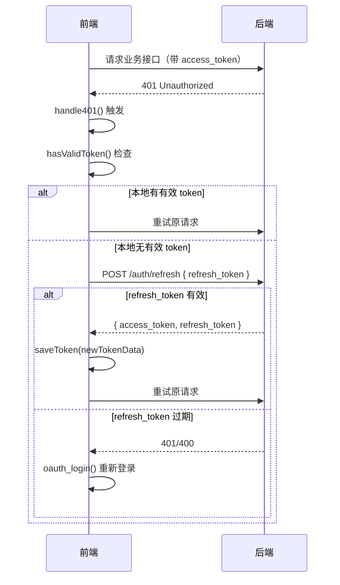

# PMS 多平台认证架构总览

## 架构演进

### 改造前（飞书依赖型）

```
飞书容器 → tt.requestAuthCode → 后端 /auth/login → JWT → 进入系统
```

**问题**：
- 仅支持飞书容器内访问
- 浏览器直接访问无法登录
- 强依赖飞书平台

### 改造后（标准 OAuth 2.0 + 统一认证）

```
┌─────────────────────────────────────────────────────────────┐
│                     前端自动判断环境                          │
└─────────────────────────────────────────────────────────────┘
                          │
          ┌───────────────┴───────────────┐
          ▼                               ▼
┌─────────────────────┐         ┌─────────────────────┐
│    飞书容器环境       │         │    浏览器环境        │
│  checkFeishuContainer │         │   !checkFeishuContainer│
└─────────────────────┘         └─────────────────────┘
          │                               │
          ▼                               ▼
  tt.requestAuthCode            跳转登录选择页面
          │                          │
          │                          ▼
          │                  用户选择登录方式
          │                          │
          │                  发起 OAuth 2.0 授权
          │                               │
          └───────────────┬───────────────┘
                          ▼
                    后端 /auth/login
                    （接收 code，签发 JWT）
                          │
                          ▼
                   保存 JWT token
                          │
                          ▼
                     进入系统
```

**优势**：
- ✅ 支持浏览器独立访问
- ✅ 保持飞书内快速登录体验
- ✅ 统一 JWT 认证体系
- ✅ 可扩展企业微信/钉钉
- ✅ 可升级为统一认证中心

---

## Provider 模式设计

### 核心类图



---

## 完整登录流程

### 飞书容器流程



### 浏览器 OAuth 2.0 流程



---

## Token 生命周期

### Token 结构

```javascript
{
    "access_token": "eyJhbGciOiJIUzI1NiIs...",  // JWT 访问令牌，7天有效
    "refresh_token": "eyJhbGciOiJIUzI1NiIs..." // JWT 刷新令牌，长期有效
}
```

### Token 刷新流程



---

## 安全设计

### State 防护（CSRF）

```javascript
// 1. 生成随机 state
const state = Math.random().toString(36).substring(2) + Date.now().toString(36)

// 2. 保存到 sessionStorage（10分钟过期）
sessionStorage.setItem('oauth_state', state)
sessionStorage.setItem('oauth_timestamp', Date.now().toString())

// 3. 回调时验证
if (options.state !== savedState || (now - timestamp) > 10 * 60 * 1000) {
  throw new Error('state 验证失败')
}

// 4. 验证后立即清除
sessionStorage.removeItem('oauth_state')
sessionStorage.removeItem('oauth_timestamp')
```

### OAuth 回调 URL 白名单

**开发环境**：
- `http://localhost:8001/pages/auth/callback`
- `http://localhost:8006/pages/auth/callback`
- `http://localhost:88/pages/auth/callback`

**测试环境**：
- `https://pms-test.lingyang-electronics.com/pages/auth/callback`

**生产环境**：
- `https://pms.lingyang-electronics.com/pages/auth/callback`

---

## 文件清单

### 已创建文件

| 文件路径 | 说明 |
|---------|------|
| `common/config/authProviders.js` | 平台 Provider 配置文件 |
| `common/auth/core/LoginProvider.js` | 抽象基类，定义 Provider 接口 |
| `common/auth/core/ProviderRegistry.js` | Provider 注册中心（单例模式） |
| `common/auth/core/EnvironmentDetector.js` | 环境检测器 |
| `common/auth/providers/FeishuProvider.js` | 飞书 Provider 实现 |
| `common/auth/callback/CallbackHandler.js` | OAuth 回调处理器 |
| `common/auth/utils.js` | 工具函数集合 |
| `common/auth/index.js` | 统一导出入口 |
| `pages/auth/login-select.vue` | 登录方式选择页面 |
| `pages/auth/callback.vue` | OAuth 回调处理页面 |

### 已修改文件

| 文件路径 | 修改内容 |
|---------|----------|
| `common/auth.js` | 新增环境判断，修复 `hasValidToken()` 布尔逻辑 |
| `common/global.js` | 修改 `oauth_login()` 增加环境判断和路由 |
| `pages/index/index.vue` | 修改 `refreshToken()` 防止无限登录循环 |
| `pages.json` | 添加 `login-select` 和 `callback` 路由 |
